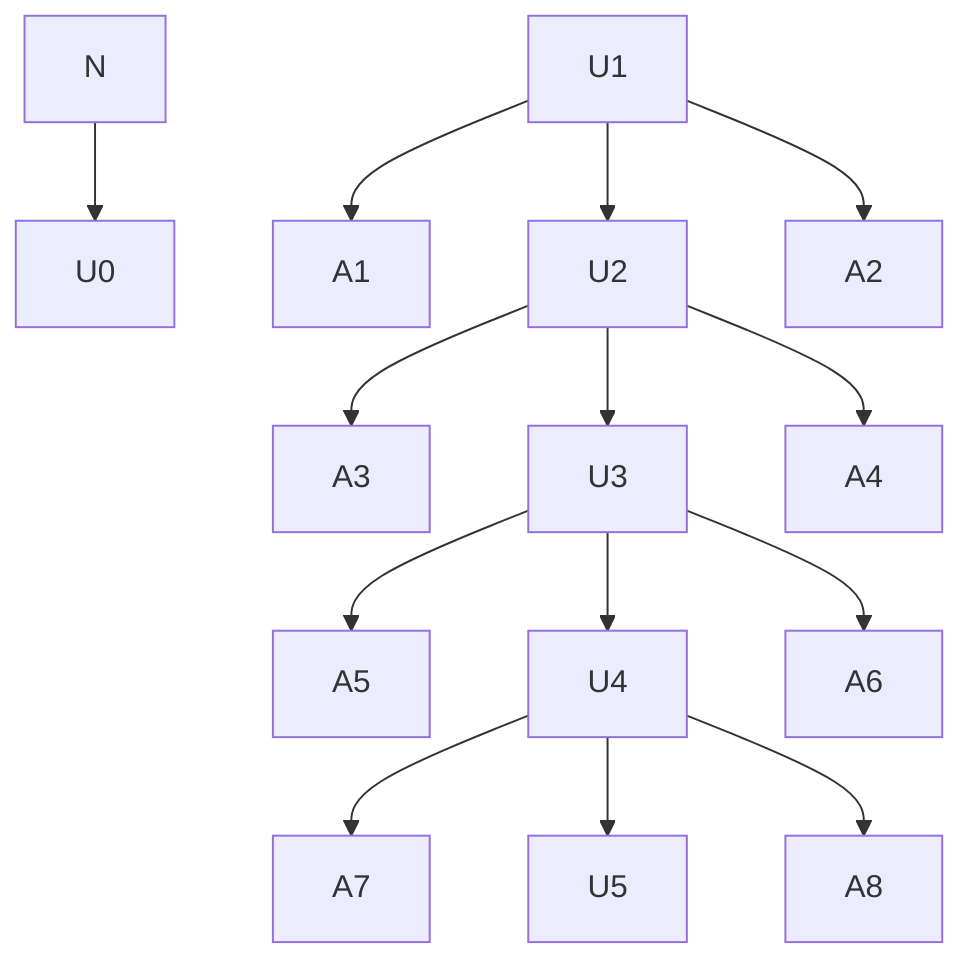

# Introduction + Background theory
Neutrons glaze... 

In order to study neutrons, experiments such as UCNTau+ and nEDM require an efficient means of transporting neutrons from their source. In other words, few neutrons should be lost during the transportation process. On the other hand, the neutron source shouldn't produce so many neutrons that it blows up.
Furthermore, when neutrons interact with low-enriched Uranium (LEU), they can fission which produces more neutron(s). As neutrons fission and create more neutrons, the new generation of neutrons can go onto fission themselves. This process is called a chain reaction and is depicted in Fig. 1. Furthermore, the ratio of neutrons in the current generation to the previous generation, called $k_{eff}$, is used to describe the efficiency of a neutron source and whether or not it is safe. This parameter is dependant on the materials used in the source as well as the geometry.

Chain Reaction Diagram

  Figure 1: <em>The initial neutron fissions with U92 creating 3 more neutrons. Two of those neutrons go off into space but one of them fissions with U92 again. This process repeats itself.</em>

---

When $k_{eff}$ exceeds 1, the chain reaction blows up and the system is said to have reached criticality. To maintain safety, a safety threshold is defined near $k_{eff}$ = 1. So, ideally a neutron source should exhibit a $k_{eff}$ value at its safety threshold. 

Monte-Carlo simulations

The Monte Carlo N-Particle (MCNP) code uses Monte Carlo simulations to estimate $k_{eff}$ for a given geometry and materials. In this code, the processes of many individual neutrons are simulated and the individual $k_{eff}$'s are averaged.

Each process involves imposing random walks on a neutron, modeling interactions after each step of the walk, and tracking the number of the new neutrons produced if it fissions. The interaction amplitudes are contained in a large of collection of data to which the MCNP code uses to calculate the probability of an interaction at the given initial and final momenta of the step.

This project uses the MCNP code to analyze $k_{eff}$ across various geometries of an 18kg mass of low enriched Uranium. Researches at LANL are exploring this as a way to boost the number of ultracold neutrons (UCNs) generated at LANSCE, and the neutron source of course needs to avoid criticality. Thus this project aims to generate a geometry that achieves critically to demonstrate that a geometry exists that is close to critically. Altogether, the optimal geometry should bring $k_{eff}$ as close as safely possible to criticality at $k_{eff} = 1$, and generating a geometry that achieves criticality will demonstrate this is likely possible.

# Procedure

Code not allowed to be provided...

The MCNP code uses Monte Carlo methods to simulate neutron transport. The explanation of what the code does can be split up into 3 general categories of discussion: Geometry, Interactions, and Storing. First a geometry is defined as a mesh?For geometry it uses raytracing (which I don't know what that is so Im skipping this rn). To simulate interactions, it uses a large collection of data that contains the amplitudes for many interactions. Then, the amplitudes correspond to the probability of an interaction to occur at the given state or step to the next state or step. The history of a particle is stored and the simulation is iterated over a large number of particles who's historical information is averaged to approximate the solution.

Maybe I can put my input files? If not, I'm having trouble structuring this section.

For different geometries and mediating materials, we estimated $k_{eff}$.

# Analysis
The MCNP code estimates $k_{eff}$ using Monte Carlo simulations.

# Conclusions
Our modeled neutron source with 18 kg of LEU yields a $k_{eff}$ value of 1.3. This shows that a geometry exists that yields a $k_{eff}$ at the safety threshold.