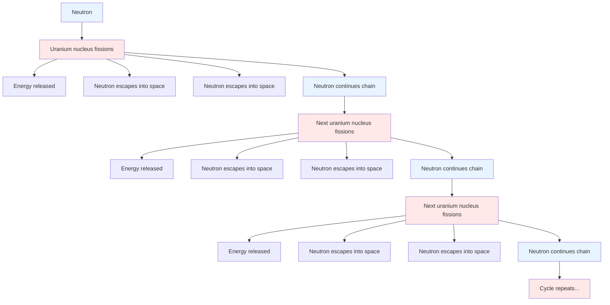
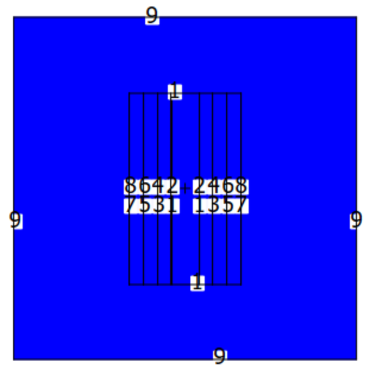
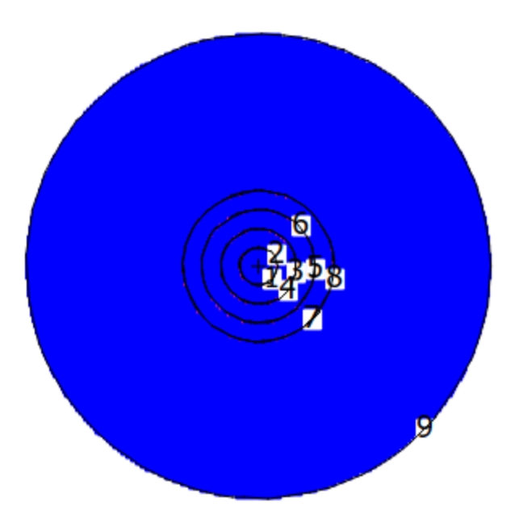
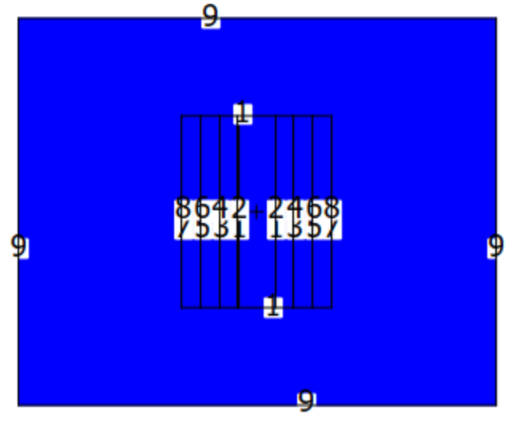
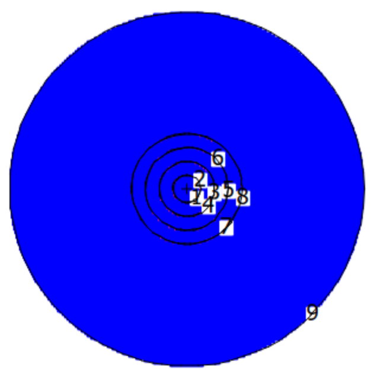

# Introduction
Neutrons are often used to probe fundamental physics. For instance, measuring a non-zero electric dipole moment of a neutron with present-day precision capabilities would provide an explanation of the matter-antimatter asymmetry of the universe. Meanwhile, measuring a value of zero at higher precisions will narrow down theories that attempt to explain the asymmetry. In order to incorporate neutrons, experiments such as UCNTau+ and nEDM require an efficient means of transporting neutrons from their source. In other words, few neutrons should be lost during the transportation process. On the other hand, the neutron source shouldn't produce so many neutrons that it blows up. Altogether, many experiments incorporate neutrons to probe fundamental physics, which requires an efficient neutron source.

### Chain Reactions
When neutrons interact with low-enriched Uranium (LEU), they can fission which produces more neutron(s). As neutrons fission and create more neutrons, the new generation of neutrons can proceed to fission themselves. This process is called a chain reaction and is depicted in Fig. 1. Furthermore, the ratio of neutrons in the current generation to the previous generation, $k_{eff}$, is used to describe the efficiency of a neutron source and whether or not it is safe. This ratio depends on the materials used in the source as well as its geometry.


Chain Reaction Diagram

<p align="center">
  Figure 1: <em>The initial neutron fissions with Uranium creating 3 more neutrons. Two of those neutrons go off into space but one of them fissions with another Uranium. This process repeats itself, yielding $k_{eff}$ = 1. </em>
</p>

---

When $k_{eff}$ exceeds 1, the chain reaction will continue to generate more and more neutrons, hence the number of neutrons blows up, and the system is said to have reached criticality. To maintain safety, a threshold is defined near $k_{eff}$ = 1. So, ideally a neutron source should exhibit a $k_{eff}$ value at its safety threshold such that it can be as efficient as possible without becoming unsafe.

### Monte Carlo N-Particle Transport
The Monte Carlo method uses simple averaging to estimate the results of a deterministic problem. It involves averaging the results or histories of individual events or cycles across many samples. The general explanation for this is somewhat broad, so to illustrate, the value of $\pi$ can be approximated via the Monte Carlo method. First, one would define a unit circle i.e. $x^{2}+y^{2}=1$ and a square such that 0 $\leq$ x $\leq$ 1 and 0 $\leq$ y $\leq$ 1. Next, generate a coordinate pair in the square using a random number generator. Then, count the number of points in the circle, $N_{Inside}$. Lastly, divide $N_{Inside}$ by $N_{Total}$ and multiply by 4 to estimate $\pi$. Try it!

```python
import numpy as np
from matplotlib.pyplot import plot as plt


N = 1000000

N_inside = 0 

for i in range(0, N):
    x= np.random.ranf(1)
    y = np.random.ranf(1)
    r  = x**2 + y**2 
    if r <= 1:
        N_inside+=1

pi = N_inside * 4 / N

print(f"pi={pi}")
```

The Monte Carlo N-Particle (MCNP) code uses Monte Carlo simulations to estimate $k_{eff}$ for a given geometry of materials. It repeats many cycles in which a first-generation neutron is spawned at a given position and it's (and following-generation neutron's) interactions are simulated. Each cycle involves imposing random walks on the neutron(s), modeling interactions after each step of the walk, and repeating the process for the following generations until $k_{eff}$ converges whence it can be accurately estimated. During this process, the interaction amplitudes are contained in a large of collection of data to which the MCNP code uses to calculate the probability of an interaction at the given initial and final momenta of the step. Then, the $k_{eff}$'s of each history is averaged to compute $k_{eff}$ of a cycle. Furthermore, the resulting $k_{eff}$'s of each individual cycle are averaged to a final $k_{eff}$ estimate.


This project uses the MCNP code to analyze $k_{eff}$ across various geometries of an 18kg mass of low enriched Uranium. Researches at LANL are exploring this as a way to boost the number of ultracold neutrons (UCNs) generated at LANSCE, and the neutron source of course needs to avoid criticality. Thus this project aims to generate a geometry that achieves critically to demonstrate that a geometry exists that is close to critically. Altogether, the optimal geometry should bring $k_{eff}$ as close as safely possible to criticality at $k_{eff} = 1$, and generating a geometry that achieves criticality will demonstrate this is likely possible.


# Procedure

The MCNP code takes input files in which surface, cell, and data cards are defined. Surface cards are used to define different shapes of surfaces and their positions. Meanwhile, cell cards are used to define the volumes between surfaces. Lastly, data cards are used to define materials, initial conditions, and statistical parameters.


### Surface Cards
The surface cards define surfaces with the given shape and position. For example, the surface card below defines a set of cylindrical surfaces centered on the Z axis with radii: 7 cm, 14 cm, 21 cm, and 28 cm.

```
c SURFACE CARDS
$ CellID   Shape/Position   Radius
1   CZ   7.000                                  
2   CZ   14.000
3   CZ   21.000
4   CZ   28.000
```
The first column of numbers are Cell ID's that can be used to reference a surface. CZ means that the surface is an infinite cylinder on the z-axis. The values in the last column are the respective radii. Other shapes can be defined such as RCC i.e. a finite-height cylinder. This would require two additional columns of data: center position (x, y, z) and height.


### Cell Cards
The cell cards you tell it about each cell or volume. Below are example cells of the volumes between each cylindrical surface from the example above.

```
c CELL CARDS
$ CellID   Material   Density   Inside   Outside   Track/kill
10   100  -18.74  1   -2      imp:n=1                      
20   200  -1.0    2   -3      imp:n=1                    
30   100  -18.74  3   -4      imp:n=1                    
40   0            +4          imp:n=0                    
```
Similar to surface cards, the first column of parameters for cell cards is the cell ID. The next column references the material that the cell is composed of, then the proceeding column tells the density of that material. The "-" sign is used for units of $g/cm^{3}$, whereas a "+" sign would indicate atoms/barn-cm. The next column(s) of parameters define the volume based on the union or intersect of surface(s). For example, "1 -2" Indicates the region defined by the intersect of the outside region of surface 1 and the inside region of surface 2. Meanwhile, "1:-2" would indicate the union of those regions. Furthermore, +1 or -1 alone would indicate outside or inside surface 1 respectively. Lastly, imp:n=1 tells MCNP to track neutrons in a cell while imp:n=0 tells MCNP to kill neutrons in a cell.


### Data Cards
The data cards define materials, initial conditions, what to calculate, and with what statistical parameters. Below are some example data cards.
```
c DATA CARDS
$ Number histories per cycle     Initial Guess keff     Number Cycles to Skip Before Tallying     Total Cycles
kcode 10000  1.0  1000  1100
$ Initial position (x, y, z)      
ksrc  0.0  0.0  0.0   
$ Material     Atomic number and number of neutrons     Percent
m100  92235 -.9473       
      92238 -.0527
m200  1001   2 
      8016   1
```
Above  we have defined water and a mix of U235 and U238 (high-enriched Uranium). The first column in a material card is its ID that can be referenced. The next column is the atomic number followed by the number of neutrons (isotope) without a space. The third column is the percentage of a material if it is a mix of atoms/isotopes. A negative number indicates a mass-percentage whereas a positive number indicates the atomic ratio. Moving on, ksrc defines the spawn point of neutrons, and finally kcode sets the statistical parameters for the simulation. In order of first to last column, it includes the number of particle histories per cycle, initial $k_{eff}$ guess, number of cycles to skip before storing $k_{eff}$ measurements, and total cycles to simulate.

### Method
Our goal was to demonstrate that an efficient neutron source can be achieved using 18kg of LEU (80-20). Because we were not limited by certain factors that a real-life neutron source might be limited by, such as mechanical support, we decided to use cylindrical surfaces, since cylinders are hard to achieve criticality with. The idea is that using cylinders, as opposed to spheres for example, should counteract the $k_{eff}$ loss due to niche physical limitations. On the contrary, we implemented layering of LEU cylindrical shells with water between each layer. The water serves as a mediating material, so in other words, it slows the neutrons down so that they are more likely to fission. Altogether, we aimed to reach criticality specifically by using a set of concentric cylindrical shells with water between each layer. 

In order to optimize the geometry of our system to reach criticality, we observed general trends in a parameter's affect on $k_{eff}$. To explain, we would change one parameter at a time, such as the spacing of water between the layers of LEU shells, in order to single out its affect. We were somewhat limited in our ability to single out a parameter's affect, since we would sometimes have to adjust other factors accordingly to ensure we weren't using more than 18 kg of LEU. However, we were still able to find general trends and optimize parameters accordingly.

# Data & Findings


## General Trends
After many runs of estimating $k_{eff}$ with varying geometric parameters we observed general trends based on how we changed each parameter. We grouped the discussion of parameters into categories below based on the idea that changing some parameters would require us to change other parameter(s) in order to keep the total LEU mass consistent.

### Spacing, Thickness, and Number of LEU Shells
The radii, thickness, and number of LEU Shells must be adjusted accordingly in order to maintain a consistent 18kg total LEU mass. Logically, given a large amount LEU, the number of shells and thickness would ideally be very large. However, with a limited amount of LEU, these parameters need to be optimized accordingly with the amount of spacing between layers. In detail, the mediating layer of water may slow down the neutrons to make them more likely to fission, but more spacing requires more LEU, so as a result the number of layers or thickness of layers would need to decrease. We found that the thickness of LEU layers was worth sacrificing to increase the number of layers with the optimal spacing of water between them. Then, we took many runs with different radii to balance the optimal spacing of water with the optimal thickness of LEU layers. Altogether, we concluded that it is most optimal to use four 65 mm LEU shells consistently spaced by 4 cm of water from layer to layer.


### Height and Top / Bottom of Cylindrical Surfaces
The next set of factors we categorized is the height of the cylinders and whether or not to include the top and bottom parts of the cylindrical LEU shells. To explain, including top and bottom surfaces would ensure that no neutrons escape without contacting LEU, however, it is very mass-expensive. We found that it is actually more ideal to spend the mass to increase the height of each shell then it is to include a top and bottom on the shell. The reason for this is that once the height is be increased, relative to the radii, to a certain degree there is a low probability for a neutron to escape without contacting LEU. Although the probability of a neutron escaping without contacting LEU remains non-zero, this method is much more cost-effective, and it evidently yields higher $k_{eff}$.


## Optimal Geometry Results

### Max $k_{eff}$ 18 kg Geometry
The geometry that yielded our maximum estimate of $k_{eff}$ is shown in Fig. 2. It incorporates four 65 mm thick and 56 cm tall LEU shells spaced apart by 4 cm of water. Additionally, the inner-radius of the center shell is 4 cm. The geometry does not include top and bottom parts of the LEU shells because of the mass opportunity cost as previously mentioned. This geometry yields $k_{eff}$ = 1.0386 with a standard deviation of 0.0006.

<p align="center">
  
</p>

<p align="center">
  Figure 2: <em>Left: Side view. Right: Top view. Visual of the geometry that yielded our max estimate of $k_{eff}$. The black lines represent the surfaces with Uranium between them on the sides of the cylinder. The blue space depicts water.</em>
</p>

### Rough Safety Threshold $k_{eff}$ with 12 kg LEU Geometry
The geometry depicted below uses 12 kg of LEU and yields $k_{eff}$ = 0.991 with a standard deviation of 0.008. It involves four 60 mm thick and 42 cm tall LEU shells with 4 cm of water spaced between them. It also does not use LEU on the top and bottom portions of the shells. Additionally, it is important to note that the safety threshold is not implicitly defined, so this may not reach the safety threshold under certain definitions. A simple fix would be to adjust the height or enrichment percent distributions, which would not require other parameters to be adjusted accordingly.

<p align="center">
  
</p>

<p align="center">
  Figure 2: <em>Left: Side View. Right: Top view. Visual of the geometry that yielded our safety threshold estimate of $k_{eff}$ using 12 kg of LEU. The black lines represent the surfaces with Uranium between them on the sides of the cylinder. The blue space depicts water.</em>
</p>


# Conclusion

In retrospect, Researchers at LANL are interested in using an 18 kg mass of Uranium to boost the number of UCNs generated at LANSCE. In order to demonstrate the possibility of creating an efficient neutron source using 18kg of LEU, we demonstrated a geometry that achieved criticality using cylinders. Cylinders are sub-optimal for neutron sources, so using them counteracts real-life factors, such as structural support, to a degree. We were able to model such a geometry that yields $k_{eff}$ = 1.0386 with a standard deviation of 0.0006. We were also able to produce a geometry using only 12 kg of LEU that yields $k_{eff}$ = 0.991 with a standard deviation of 0.0008. This supports the possibility of creating an efficient and safe neutron source with 18 kg of LEU.


# Attributions
I had the help of Dr. Blatnik to teach me how to use the MCNP code, and explain concepts like chain reactions and the idea that cylinders are less optimal than spheres. She also sent me slides about MCNP that I referenced a lot. I also used the documentation on MCNP included in the package to figure out what some of the parameters for kcode were.

### Timekeeping

I estimate about 12-15 hours total.


I spent an hour 4/28? playing around with geometries but not optimizing yet. I was still getting the hang of using MCNP.

I spent another hour Tuesday 4/28 fleshing out my outline, and completing my intro+background mostly.

I spent roughly 4 hours 4/30, 5/1 (split between before midnight and early morning) on optimizing geometries. 

I spent 4 hours tonight 5/4, 5/5 (split around midnight) finishing my writeup.

Before 4/28 I was not recording what I did in my CodeLog, but I had a rough outline filled in that was mostly just intro+background. I had also reproduced the Godiva sphere and read through MCNP slides and stuff. I also had another Zoom meeting with Marie at some point before 4/28, but I forgot what the date was. I'm not counting this in my estimate, but there's also time I spent writing the proposal to request MCNP and a bunch of emails.

### Languages, Libraries, Lessons Learned
I learned how to use the MCNP code. I learned how chain reactions and fission works. I learned the basics of what goes into the process of making/modeling a neutron source.