# Introduction
As particles move through a medium such as air or water, they can bounce off other particles which effects their motion. This phenomena is referred to as Brownian motion. Now, suppose a seed exists that incoming particles can stick to and once a particle sticks to the seed, it becomes a part of the seed. This process is called diffusion-limited aggregation (DLA), and it is observed in many physical systems such as crystal formation.

DLA can be modeled using a simulation in which Brownian motion is simulated as a random walk. In other words, DLA is a process in which particles take random walks in a region where there exists a seed to which the particles stick. As more particles stick to an aggregate it forms into a fractal with a certain property that pertains to its geometry. This property is known as  capacity dimension, and it can have non-integer values as opposed to topological dimension. It is defined as Eq. 1 and can be estimated by overlaying space with boxes of side length $\epsilon$ and counting the number of boxes, N, that contain part of the aggregate. This process is repeated for decreasing $\epsilon$ then $\ln N(\epsilon)$ vs. $\ln (\frac{1}{\epsilon})$ is plotted where the slope yields the capacity dimension.

$$
D_C=\lim_{\epsilon\to 0}\frac{\ln N(\epsilon)}{\ln\left(\frac{1}{\epsilon}\right)}
\qquad\text{(1)}
$$
where $D_{C}$ is the capacity dimension, $\epsilon$ is the size of boxes, and N is the number of boxes. Furthermore, the expected value of the capacity dimension of a DLA fractal is 1.7 [1]. Accordingly, the capacity dimension of a simulated aggregate can be compared with this value to evaluate the accuracy of the simulation. Capacity dimension can additionally be used to evaluate the effects of certain aspects of the model on its accuracy. For instance, if the simulated flux of incoming particles is not uniform, the capacity dimension would likely stray away from its expected value for a uniform flux system.

Another useful fractal dimension is the mass-radius fractal dimension. It is defined by
$$
N(r) = r^{D_{r}}\qquad(2)
$$
where $r$ is the distance from the center of the aggregate, $N(r)$ is the number of occupied elements within radius $r$, and $D_{r}$ is the fractal dimension. This dimension essentially describes the density of the aggregate. It has a maximum value of 2 in 2D space which would result from a filled in circle.

In this project, we model diffusion limited aggregation for a 2D system with a uniform incoming flux of particles from an infinite radius. We evaluate the capacity dimension of our simulated aggregate at different values of stickiness and radius. Then, we compare our estimated value to its expected value. In addition, we evaluate the effect of letting the spawn radius approach the aggregate.

# Procedure 
Our simulation code is described in a step by step manner below containing the main steps to model DLA. We use a boolean array to model 2D space in which each element's truth value corresponds to whether it is occupied or not. Next, we define a function that spawns particles on an approximately circular parameter centered around the aggregate. The spawn probability is uniformly distributed about the circle. Then, a kill radius is implemented to improve runtime efficiency. Lastly, random.getrandbits() is used to implement random walks, and the 3x3 neighborhood around the particle is checked for the seed after each walk. This process is repeated until the particle sticks to the aggregate.

1.  Initializing a 2D space array
```python
space = np.zeros((length, length), dtype=bool)            
space[length//2, length//2] = True                        
```

A boolean array is used to represent discrete 2D space (length x length blocks): An element is true or 1 if occupied and false or 0 if empty. The seed is initialized in the center.

2. Defining a function to spawn particles
```python
def spawn(spawn_radius):
    theta = np.random.uniform(0, 2 * np.pi) 
    x, y = int(spawn_radius * np.cos(theta)), int(spawn_radius * np.sin(theta))
    return x, y
```
The spawn function is called to spawn a particle at a random angle on an approximate circular parameter around the aggregate. We played around with different conditions for the radius of the parameter. Mainly we explored two conditions based on the radius of the aggregate's longest branch, $r_{max}$: radius = $r_{max}$ + 10 and radius = 2 * $r_{max}$.

3. Implementing a kill radius
```python
def kill(i, x, y):
    global length, space, heat, spawn_radius 

    r_i = int(np.sqrt((x - length//2)**2 + (y - length//2)**2)) + 1          

    if r_i > 3 * spawn_radius + 10:
        return True
    else:
        return False
```
The kill function prevents particles from wandering far away from the circle. This tremendously improves runtime as particles are not allowed to wander far away which causes them to take much longer to find the aggregate. If the particle wanders more than 10 blocks outside the spawn radius, it is killed and respawned. Additionally, a kill radius does not alter the accuracy of the model because a particle has the same probability of being killed regardless of where it spawns and the spawn probability is uniformly distributed about the spawn parameter.

4. Implementing random walks & checking neighbors
```python
    # Loop until the particle sticks to seed
    while (True):                           
        # RANDOM WALK ALGORITHM
        direction = random.getrandbits(2)
        
        new_x, new_y = x, y

        if direction == 0:
            new_y += 1
        elif direction == 1:
            new_y -= 1
        elif direction == 2:
            new_x -= 1
        else:
            new_x += 1

        # ensures space is not already occupied
        if 0 < new_x < length-1 and 0 < new_y < length-1 and not space[new_x, new_y]:
            x, y = new_x, new_y

        # checks if particle is too far from the seed and kills it if it is
        if kill(i, x, y):

            # respawns particle at random point on circle                                                         
            x, y = spawn(spawn_radius)

            # aligns circle to be centered at the seed                                                   
            x += length // 2                                                            
            
            y += length //2                                                            

            continue                                                     

        # Check if particle is next to the seed (3x3 neighborhood)

        # only checks if particle is not on the edge to avoid errors                                                                 
        if 0 < x < length-1 and 0 < y < length-1:                               
            if ((space[x-1, y] or space[x,   y-1] or space[x, y+1]
                or space[x+1, y]) and not space[x, y]):                         
                # not space ensures spot is not already occupied 

                # Chance of sticking to the seed is the stickiness factor
                if np.random.rand() < stickiness:                               
                    space[x, y] = seed
                    # tracks the age of the particle that sticks to the seed
                    heat[x, y] = i + 1                                          
                    resizing_square(i, x, y)
                    resizing_circle(i, x, y)
                    break                                                     
```
The random walk algorithm chooses a random direction for the particle to walk. The random.getrandbits() function is used for optimal runtime. Then, the 4 neighboring elements are checked if they are part of the aggregate, and the current position is required to not already be occupied. The particle takes random walks until it reaches the aggregate. Once the particle reaches the aggregate, it has a chance of sticking. And once the particle sticks, the loop breaks.

# Results & Analysis

DLA Animation: link

-------

A heat map of particle ages can be visually inspected to serve as sort of a preliminary analysis. Fig. 1 shows heat maps for 50,000 and 20,000 particles. We observe that as the distance from the center of the aggregate increases, the particles become more recent. Additionally, the more recent particles tend to stick on the tips of the branches. Both of these observations match what we should expect. Next, the capacity and mass-radius fractal dimensions are estimated. A simulation of 50,000 particles yielded $D_{C}$ = 1.47 and $D_{r}$ = 1.61 as shown in Fig. 2. We further analyzed these capacity dimensions in regards to their behavior as a function of sticking probability, $S$. We observed a general trend for both fractal dimensions to increase as $S$ decreases illustrated in Fig. 3. Furthermore, this trend appears linear for $S$ > 0.5. However, as $S$ approaches zero the fractal dimensions increase dramatically. Log-log plots reveal an exponential relationship. The log-log plot of $S$ vs $D_{C}$ has a slope of $m$ = -0.03. Meanwhile, the log-log plot of $S$ vs $D_{r}$ has a linear slope of $m$ = -0.02. Lastly, we analyzed the fractal dimensions as a function of number of particles. As shown in Fig. 4, the fractal dimensions remain relatively consistent across various values of N. Additionally, there is a subtle trend that as the number of particles increases, the fractal dimensions increase in the direction approaching their expected values.

<p align="center">
  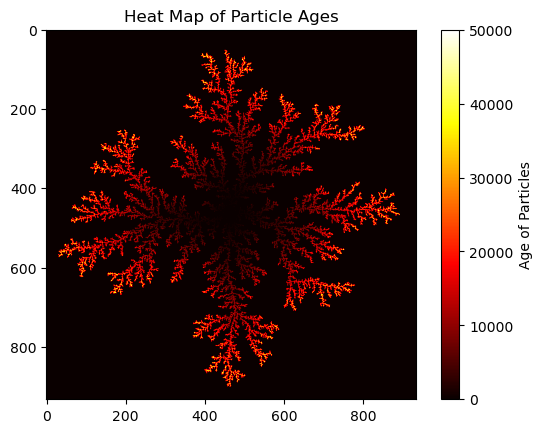
  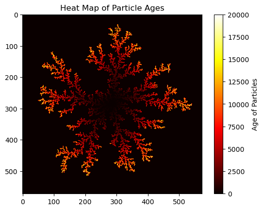
</p>

<p align="center">
  Figure 1: <em>Left: Aggregate for 50,000 particles at a sticking probability of 1. Its estimated capacity and mass-radius fractal dimensions are 1.47 and 1.67 respectively. Right: Aggregate for 20,000 particles at a sticking probability of 1. Its estimated capacity and mass-radius fractal dimensions are 1.46 and 1.61 respectively.</em>
</p>
__________________________________________________________________________________________________________________

<p align="center">
  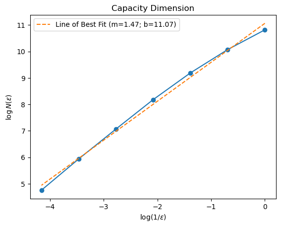
  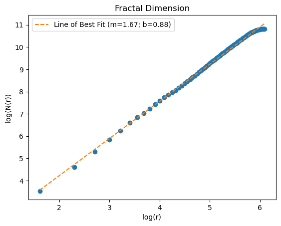
</p>

<p align="center">
  Figure 2: <em>Left: Capacity dimension estimation for 50,000 particles at a sticking probability of 1. Right: The radius-mass fractal dimension of the aggregate generating by 50,000 particles at a sticking probability of 1. </em>
</p>
__________________________________________________________________________________________________________________

<p align="center">
  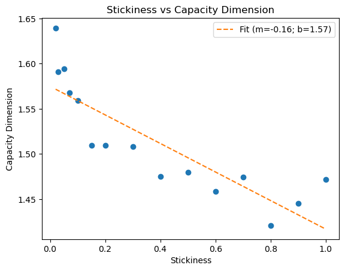
  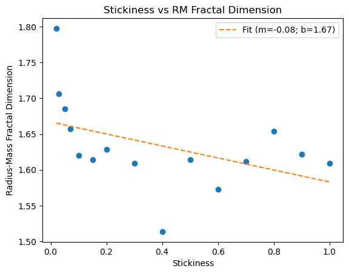
  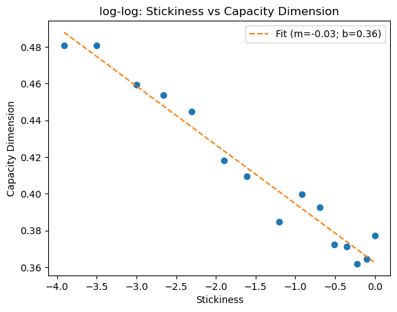
  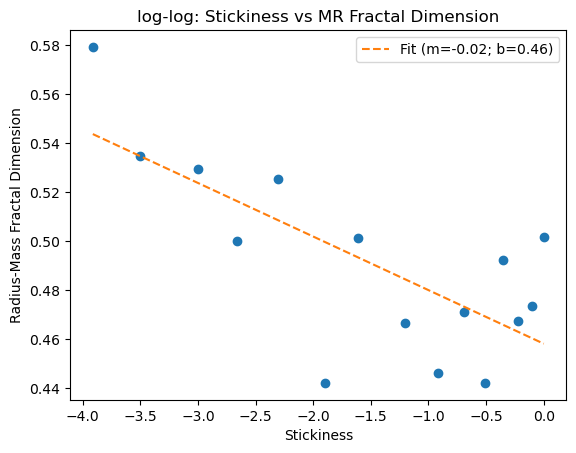
</p>

<p align="center">
  Figure 3: <em>Left: Sticking probability vs Capacity Dimension. The capacity dimension tends to get larger for lower sticking probability. Right: Sticking probability vs Radius-mass fractal Dimension. The fractal dimension tends to get larger for lower sticking probability.</em>
</p>


-----------------------------------

<p align="center">
  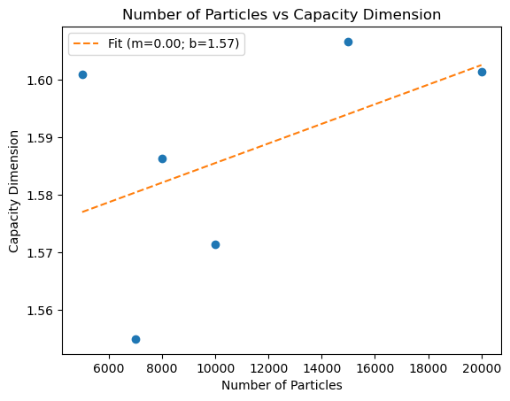
  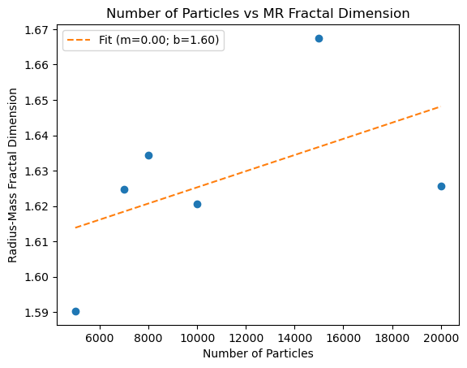
  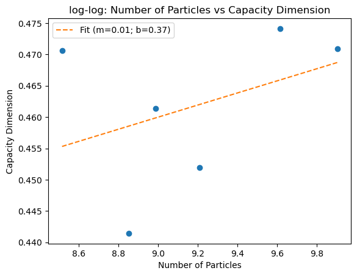
  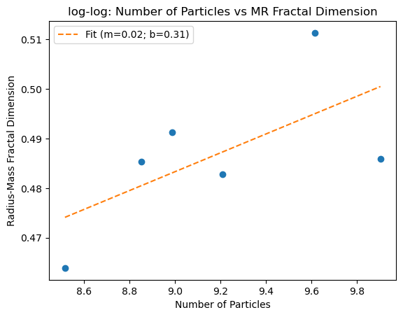
</p>

<p align="center">
  Figure 4: <em>Left: Number of Particles vs Capacity Dimension. The capacity dimension subtly increases with N in a consistent and predictable manner. Right: Number of Particles vs Radius-mass fractal Dimension. The fractal dimension seems to subtly approach its expected value as N increases.</em>
</p>

# Conclusions
Diffusion-limited aggregation is a process in which particles undergoing Brownian motion encounter a seed and form an aggregate. This process can be modeled using a random walk algorithm, and a kill radius should be implemented to optimize runtime. Furthermore, fractal dimensions are metrics that describe the density of a fractal. The estimated fractal dimensions of a model can be estimated and compared to their expected values to analyze the accuracy of a model.

Our model simulates a uniform one-way flux of incoming particles from infinity. A simulation of 50,000 particles yielded $D_{C}$ = 1.47 and $D_{r}$ = 1.67. In comparison its the expected value of 1.7, our estimated value of $D_{C}$ is noticeably off as it barely falls within 15% error. This supports the idea that our model is not completely accurate or that there is an error in our estimation of $D_{C}$. On the other hand, our estimation of $D_{r}$ lies comfortably within 5% error. This alludes to the idea that our model is fairly accurate. Additionally, these fractal dimensions grow with N or r with slope/rate. 

Altogether, we cannot confidently say that our model is highly accurate as our estimated $D_{C}$ falls outside of 5% error. However, we do believe there is a plausible argument to be made for some high degree of accuracy that is supported by our estimation of $D_{r}$, its consistency across different numbers of particles, and its tendency to increase towards its expected value as the number of particles increases.


# References
[1] [Diffusion-Limited Aggregation, a Kinetic Critical Phenomenon (1981 PRL)](https://journals.aps.org/prl/abstract/10.1103/PhysRevLett.47.1400)

# Appendix
## Extension 1
In 3D the mass-radius estimation of the fractal dimension is 2.13 for 5000 particles. This is greater than the fractal dimension in 2D, but you would expect the fractal dimension to be greater in higher dimensions.

<p align="center">
  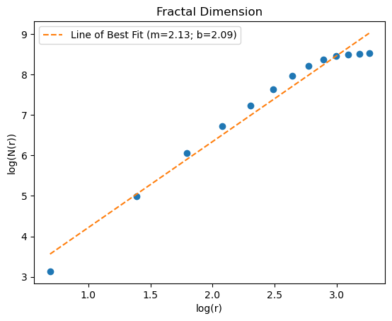
</p>

<p align="center">
  Figure 5: <em>Mass-radius estimation of fractal dimension for 5,000 particles in 3D.</em>
</p>

Logic-wise this was easy to implement in my code. I just had to make everything 3D. For example, this is the new spawn function:
```python
def spawn(radius):
    # generates a random angle between 0 and 2pi
    theta = np.random.uniform(0, 2 * np.pi)                                  
    # random angle between 0 and pi                               
    phi = np.random.uniform(0, np.pi)               
    x = int(round(radius * np.sin(phi) * np.cos(theta)))
    y = int(round(radius * np.sin(phi) * np.sin(theta)))
    z = int(round(radius * np.cos(phi)))
    return x, y, z
```
## Extension 2
Using a triangle lattice in 2D space does not really change the behavior. The fractal dimension estimated using the mass-radius method is consistent with the original 2D estimation. 
<p align="center">
  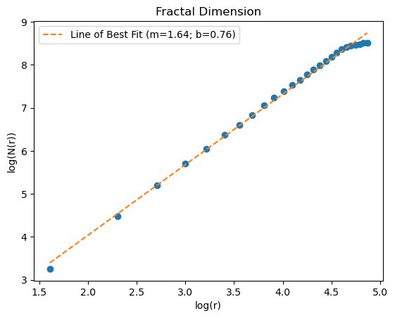
</p>

<p align="center">
  Figure 5: <em>Mass-radius estimation of fractal dimension for 5,000 particles in a 2D triangle lattice.</em>
</p>

By treating the rows as offset by 1, I modeled the a triangle lattice around the particle. So, although the space array does not represent a triangle lattice, the particle is restricted to move on triangle lattice sites.
```python
        direction = random.randrange(6)
        
        new_x, new_y = x, y

        if y % 2 == 0:   # treats rows as offset by 1
            if direction == 0:
                new_y += 1
            elif direction == 1:
                new_y -= 1
            elif direction == 2:
                new_x -= 1
            elif direction == 3:
                new_x += 1
            elif direction == 4:
                new_x -= 1
                new_y -= 1
            else:
                new_x -= 1
                new_y += 1
        else:            # treating rows as offset by 1
            if direction == 0:
                new_y += 1
            elif direction == 1:
                new_y -= 1
            elif direction == 2:
                new_x -= 1
            elif direction == 3:
                new_x += 1
            elif direction == 4:
                new_x += 1
                new_y -= 1
            else:
                new_x += 1
                new_y += 1
```

```python
            if y % 2 == 0:
                if ((space[x-1, y] or space[x+1, y] or space[x,   y-1] or
                     space[x,   y+1] or space[x-1, y-1] or space[x-1, y+1]) 
                     and not space[x, y]):       

                    if np.random.rand() < stickiness:                               # Chance of sticking to the seed is the stickiness factor
                        space[x, y] = seed
                        heat[x, y] = i + 1                                          # tracks the age of the particle that sticks to the seed
                        resizing_square(i, x, y)
                        resizing_circle(i, x, y)
                        break                     
            else:
                if ((space[x-1, y] or space[x+1, y] or
                     space[x,   y-1] or space[x,   y+1] or
                     space[x+1, y-1] or space[x+1, y+1]) 
                     and not space[x, y]):
```

### Attribution
[Diffusion-Limited Aggregation, a Kinetic Critical Phenomenon (1981 PRL)](https://journals.aps.org/prl/abstract/10.1103/PhysRevLett.47.1400)

Some Stuff on Fractal Dimension:

The stack overflow link talks about the mass-radius estimation for fractal dimension.
https://stackoverflow.com/questions/76326172/fractal-dimension-with-the-mass-radius-method

https://en.wikipedia.org/wiki/Fractal_dimension#Examples
### Timekeeping
I didn't keep a log but I can very confidently say I spent upwards of 20 hours total. Unfortunately, I spent the majority chunk of this time optimizing my code for run time and my 1 million particles still hasn't finished.
### Languages, Libraries, Lessons Learned
I used python with standard numpy and matplotlib. I also used random, and %timeit to profile and optimize my code. I learned a lot about profiling/ runtime optimization and fractal dimensions.


### Changelog Summary
The code described above took a long time to optimize the runtime for large N. Below, we share the trials and errors that led up to the code above.
#### Periodic Boundary Conditions
The first big thing we implemented was periodic boundary conditions to prevent the particles from wandering too far away from the seed. We implemented this using the mod operator as shown below:
``` python
        direction = np.random.choice(['up', 'down', 'left', 'right'])
        if direction == 'up':
            y = (y + 1) % length
        elif direction == 'down':
            y = (y - 1) % length
        elif direction == 'left':
            x = (x - 1) % length
        elif direction == 'right':
            x = (x + 1) % length
```


#### Resizing Boundary
Initially, we also started with a 100 block square spawn parameter centered around the seed. After running a simulation with 1000? particles we observed that the particles accumulated on the edges as they spawned in which is not realistic as the spawn parameter just represents the income of the particles at that point--- they don't just spawn there out of thin air. So, we increased N to avoid this; however, increasing N resulted in a much longer run time since the particles took longer to walk further to the seed. So, then we implemented the resizing functions to keep the spawn parameter at a balanced distance from the seed. The distance was chosen to be 3 times the radius of the aggregate point furthest from the origin. 

```python
def resizing():
    ##############################################
    # Adaptive resizing
    global length, space, heat                                          # I should probably pass these later but rn Im just testing stuff
    
    r_max = np.max(np.abs(np.argwhere(space) - length//2)) + 1          # max distance from the center seed
    if length < 3 * r_max:                                              # condition to adjust length
        new_length = 3 * r_max
        if new_length % 2 == 0:                                         # ensures new length is odd so seed can remain centered
            new_length += 1

        new_space = np.zeros((new_length, new_length), dtype=bool)      # adjusts space to new length dimensions
        new_heat = np.zeros((new_length, new_length))                   # adjusts heat to new length dimensions

        shift = (new_length - length) // 2                              # shift such that the space expands outwards from center

        crystal_indices = np.argwhere(space)                            # ^ adjusts space such that it adds space outwards from center
        for x, y in crystal_indices:
            new_space[x + shift, y + shift] = True
            new_heat[x + shift, y + shift] = heat[x, y]
        
        length = new_length                                             # updates length
        space = new_space                                               # updates space
        heat = new_heat                                                 # updates heat

    ##############################################
```

#### Circular Spawn Parameter
Yet, we still weren't satisfied with the runtime, so we changed the shape of the spawn parameter to a circle instead of a square. This change allowed us to spawn particles closer to the crystal. To visualize this, imagine two concentric squares where the particles pass into the exterior square in a uniformly distributed manner and take random walks. They will not pass through the interior square in a uniformly distributed manner. Meanwhile, for a pair of concentric circles, if the particles pass into the exterior circle in a uniformly distributed manner then they will pass through the interior circle uniformly. Naturally, we also wrote a resizing function for the circle which was based of the maximum distance of a crystal point from the center plus 10.

```python
def generate_space(radius):
    num_edge_blocks = int(2 * np.pi * radius)                                                               # num edge blocks is the integer value of circumerence
    theta = np.linspace(0, 2 * np.pi, num_edge_blocks, endpoint=False)                                      # generates num_edge_blocks angles evenly spaced around the circle
    x, y = np.round(radius * np.cos(theta)).astype(int), np.round(radius * np.sin(theta)).astype(int)       # finds the x and y positions of the points on the circle
    return x, y

x, y = generate_space(radius)
circle_set = np.unique(np.column_stack((x, y)), axis=0)         # pairs x and y defines the circle (np.unique removes any duplicates due to rounding)
```


#### Spawn Function
The early versions of the spawn function would define a segmented curve and pick a random point on that curve. We later changed this to pick a random angle at the set radius which is faster.
```python
def spawn(radius):
    theta = np.random.uniform(0, 2 * np.pi)                                                                 # generates a random angle between 0 and 2pi
    x, y = int(radius * np.cos(theta)), int(radius * np.sin(theta))
    return x, y
```

#### Checking r_max
Initially, we were checking the max radius by using np.max to sift through the distance of each point on the crystal for every loop of N. We improved the efficiency of this search by storing the initial r_max and every new point we check if its greater than the current r_max, and if so, we update r_max.

#### Random Walk Algorithm
Initially, we were using np.random.choice to choose up, down, left or right. We later changed this to np.random.randint which is faster.

#### Neighborhood Check
Initially we were slicing the neighborhood with
```python
        if (space[x-1:x+2, y-1:y+2].any()):
```
yet we found that 
```python
        if 0 < x < length - 1 and 0 < y < length - 1:                           # only checks if particle is not on the edge to avoid errors (aggregate does not approach edge so this is fine)
            if (space[x-1, y-1] or space[x-1, y] or space[x-1, y+1] or          # checks 3x3 neighborhood for crystal
                space[x,   y-1] or space[x,   y] or space[x,   y+1] or
                space[x+1, y-1] or space[x+1, y] or space[x+1, y+1]):
```
is more efficient. 

#### New Boundary Conditions
We found that making the particles bounce off the walls was more efficient than using periodic boundary conditions. And they are parity symmetric so it doesn't change much. 

```python
        # RANDOM WALK ALGORITHM
        direction = np.random.randint(4)

        # particles bounce off walls instead of periodic BC but its effectively the same.
        if direction == 0:        
            if y < length - 1:
                y += 1
        elif direction == 1:
            if y > 0:
                y -= 1
        elif direction == 2:
            if x > 0:
                x -= 1
        else:
            if x < length - 1:
                x += 1
```
